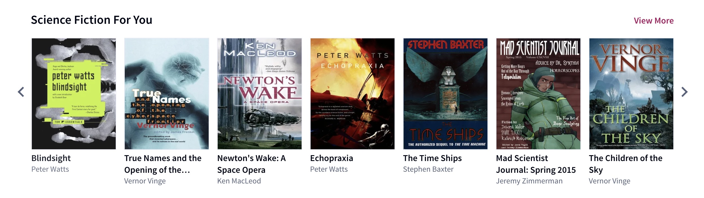
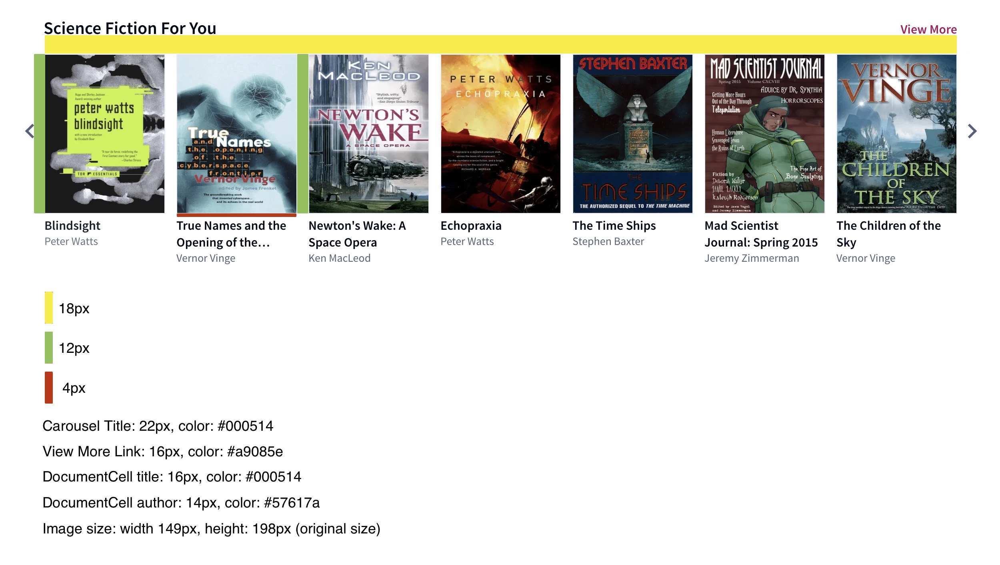

## Getting started

`yarn`

`yarn start`

## About the coding exercise

Build a carousel of items on Scribd.

Below is an example carousel:

Below are wireframes of the carouel for CSS styles:

### Additional requirements

- When the carousel is at the beginning, the left (previous) arrow should not appear
- When the carousel is at the end, the right (next) arrow should not appear
- The user should be able to scroll horizontally through the carousel with a mouse/trackpad/touchMove
- Clicking the right arrow (next), or the left arrow (previous), should navigate the user to a full new set of items
- The title should be truncated to 2 lines
- The entire cell should be clickable to the document (image, title, and author)

## Available scripts

### `yarn start`

Runs the app in the development mode. 
Open [http://localhost:3000](http://localhost:3000) to view it in the browser.

The page will reload if you make edits. 
You will also see any lint errors in the console.

### `yarn test`

Runs the app in the development mode. 
Open [http://localhost:3000](http://localhost:3000) to view it in the browser.

The page will reload if you make edits. 
You will also see any lint errors in the console.

Snapshot testing has been added to the test suite.

### `yarn build`

Builds the app for production to the `build` folder. 
It correctly bundles React in production mode and optimizes the build for the best performance.

The build is minified and the filenames include the hashes. 
Your app is ready to be deployed!

See the section about [deployment](https://facebook.github.io/create-react-app/docs/deployment) for more information.
